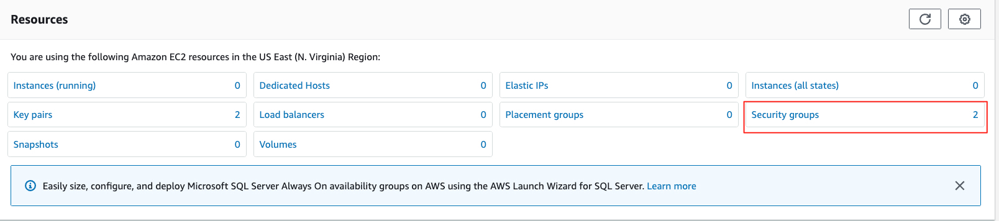
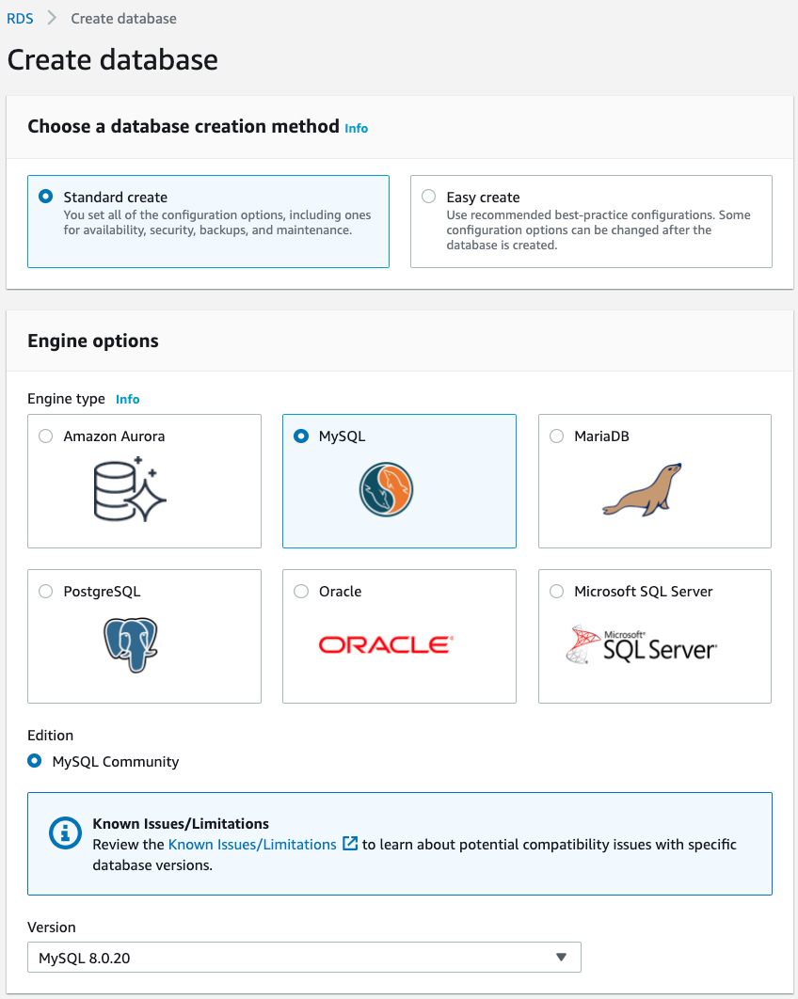
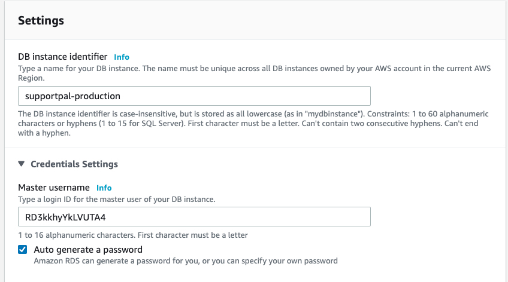
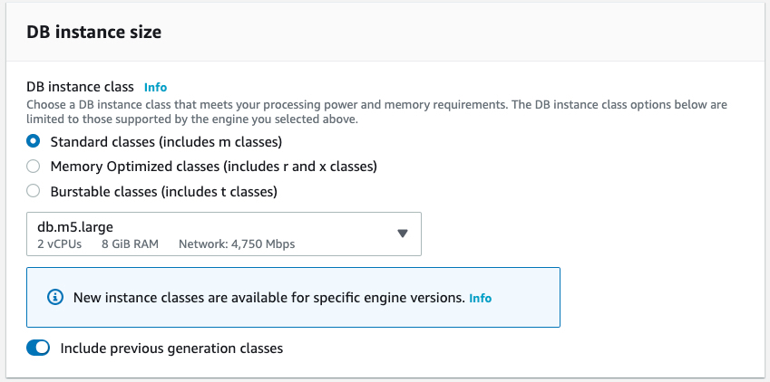
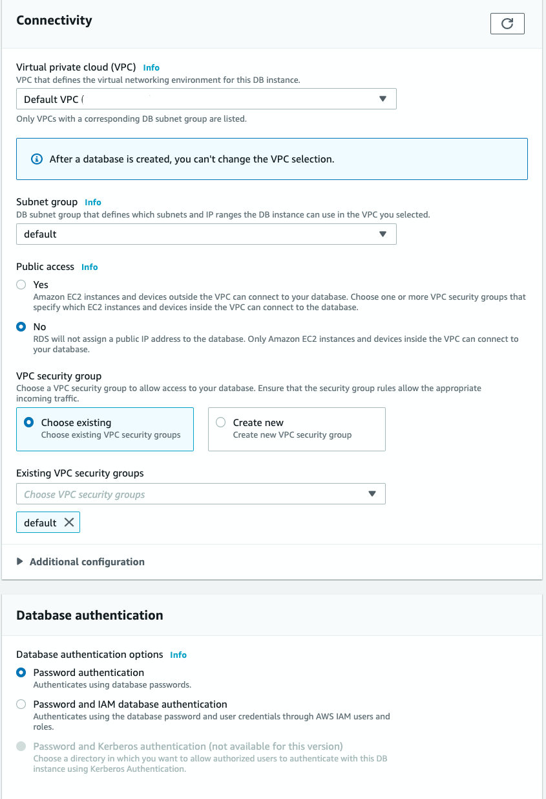
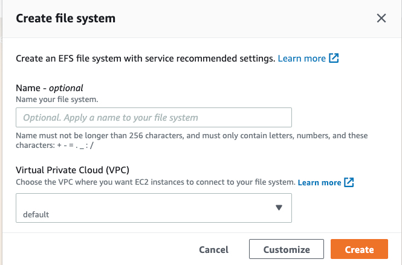
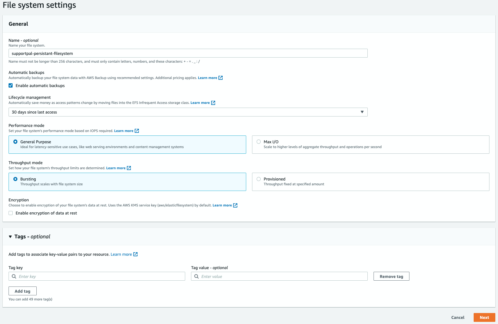
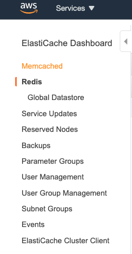
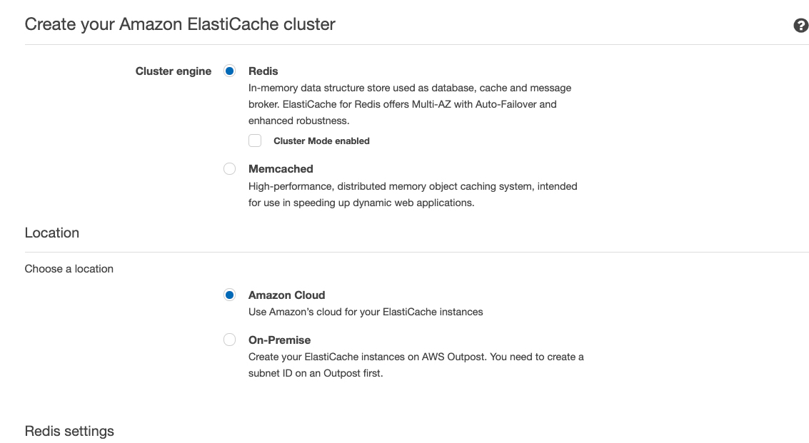

# Creating AWS dependencies

## Networking

### VPC
By default, your AWS account will include a VPC for each zone. Choose your desired zone from the AWS menu, navigate to the VPC service and take note of the default VPC-ID

### Security Groups
1. Navigate to the EC2 service
   
2. Click on security groups

       

3. Create a security group of name 'Web'
   
    **Inbound rules**
    
    | Type        | Port range    | Source         |
    | ----------- | ------------- | -------------- |
    | HTTP        |               | Anywhere       |
    | HTTPS       |               | Anywhere       |
    
    **Outbound rules**
    
    | Type        | Port range    | Destination    |
    | ----------- | ------------- | -------------- |
    | All traffic |               | Anywhere       |

4. Create a security group of name 'Internal'

   **Inbound rules**

    No rules

   **Outbound rules**

   | Type        | Port range    | Destination    |
   | ----------- | ------------- | -------------- |
   | All traffic |               | Anywhere       |

4. *Optional:* Create a security group of name 'SSH'

   **Inbound rules**

   | Type        | Port range    | Source         |
   | ----------- | ------------- | -------------- |
   | SSH         |               | Your IP        |

   **Outbound rules** 

    No rules

5. Create a security group of name 'RDS'

   **Inbound rules**

   | Type         | Port range    | Source         |
   | ------------ | ------------- | -------------- |
   | MySQL/Aurora |               | Custom - select security group of name 'Internal' (created above)       |

   **Outbound rules**

   | Type        | Port range    | Destination    |
   | ----------- | ------------- | -------------- |
   | All traffic |               | Anywhere       |

6. Create a security group of name 'EFS'

   **Inbound rules**

   | Type         | Port range    | Source         |
   | ------------ | ------------- | -------------- |
   | NFS          |               | Custom - select security group of name 'Internal' (created above)       |

   **Outbound rules**

   | Type        | Port range    | Destination    |
   | ----------- | ------------- | -------------- |
   | All traffic |               | Anywhere       |

7. *Required for HA only:* Create a security group of name 'ElastiCache'

   **Inbound rules**

   | Type         | Port range    | Source         |
      | ------------ | ------------- | -------------- |
   | Custom          | 6379               | Custom - select security group of name 'Internal' (created above)       |

   **Outbound rules**

   | Type        | Port range    | Destination    |
      | ----------- | ------------- | -------------- |
   | All traffic |               | Anywhere       |

Make note of each security group name / id, we will be using them later.

### Create MySQL Database

1. Navigate to RDS service

2. Click 'Create Database'

3. Choose a database creation method
   
   Standard create

4. Engine options
    1. Engine type: MySQL
    1. Edition: MySQL Community
    2. Version: MySQL 8 (select the latest version)

   

5. Templates
   
   Production

6. Settings
   1. DB instance identifier: supportpal-production
   2. Credentials Settings. We recommended that you let AWS auto generate the password and change the username to a password-like string.
      
      **Note:** we recommended that you create a new user aside from the master user to be used by the helpdesk, you shouldn’t provide the helpdesk the master username.

    

7. DB instance class 
   
   Choose the database instance size based on your estimated size and performance requirements

   

8. Storage

   Regardless of your current consumption, it is highly advised that you keep storage autoscaling on by default to avoid unexpected downtime

9. Availability and durability

   On production, it is recommended that you use a Multi-AZ deployment

10. Connectivity
    
    1. Virtual private cloud (VPC)
       
        Choose the same VPC where your helpdesk code, and redis server will set. Generally, this will be the default VPC
    
    2. Subnet group

       Keep the subnet group as default
        
    3. Public access

       We recommend keeping this option to `No` on production servers, if you choose this option, you will need to set up a VPN or create an EC2 instance to be able to manage your database using any MySQL client.
    
    4. Security groups
    
       Choose the security group we created earlier for RDS

11. Database authentication

    Keep default settings

    

12. Additional configuration

    Specify your initial DB name as the database you will be providing to your helpdesk
    
    Keep default settings otherwise

### Create EFS Filesystem persistent data

1. Navigate to EFS service

2. Click on create file system, click on customize

   

3. Enter a descriptive name. e.g supportpal-persistant-filesystem

4. Keep all other settings as default

5. Click next

   

6. Networking

    1. Virtual Private Cloud (VPC)
    
       Choose the same VPC where your helpdesk code, and redis server will set. Generally, this will be the default VPC
    
    2. Mount targets
    
       Select the EFS security group we created earlier for each mount target. (keep note of the chosen subnets)
       For HA deployment, make sure to add at least 2 availability zones.

7. File system policy

   Keep as default

8. Click 'Create'

### Create ElastiCache instance (Required only for HA)

1. Navigate to ElastiCache service

2. Click on Redis and then click the Create button

   

#### Location
3. Choose Redis as the Cluster engine, and Amazon cloud as location. Keep cluster mode disabled

    

#### Redis Settings

4. Enter a descriptive name and description. e.g supportpal-redis-cluster and supportpal in-memory cache

5. Keep Engine version compatibility, Port, and Parameter group settings as default

6. Node Type

   Choose the instance size based on your estimated size and performance requirements

7. Number of replicas

   Increase or decrease the number of replicas based on your estimated durability and availability requirements

8. Multi-AZ

   On production, it is recommended that you use a Multi-AZ deployment

#### Advanced Redis Settings

9. Create a new subnet group, give proper descriptive name and description

10. Select availability zones

#### Security

11. Use the previously created ElastiCache security group

12. Keep everything else as default
